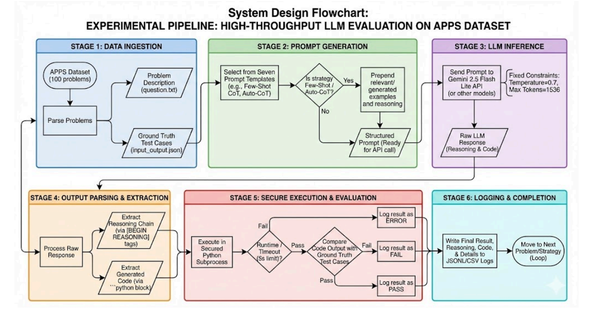
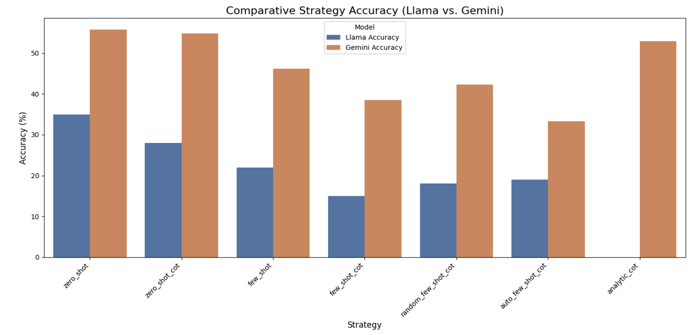

# Prompt Engineering for Competitive Programming Problems

## 🚀 TL;DR

- Evaluated **7 prompt engineering strategies** on competitive programming problems  
- Benchmarked **Gemini 2.5 Flash Lite vs Llama 4** on the APPS dataset  
- Found that **simple, structured Zero-Shot CoT prompts outperform complex Few-Shot CoT**  
- Most failures stem from **logical reasoning errors**, not syntax issues  
- Highlights that **prompt engineering is model-specific** and more context ≠ better performance

This repository presents an experimental study on how different **prompt engineering strategies** affect the performance of **Large Language Models (LLMs)** on **competitive programming and algorithmic reasoning tasks**.

The project systematically evaluates multiple prompting techniques to determine which approaches most improve **logical reasoning, algorithm selection, and code correctness**.

---

## 📌 Project Overview

While Large Language Models excel at general code generation, they often struggle with **reasoning-intensive problems**, such as competitive programming challenges. These tasks require:

- Multi-step logical reasoning  
- Correct algorithm selection  
- Efficient and error-free code synthesis  

This project investigates whether structured prompts and reasoning guidance can improve LLM performance in such domains.

---

## 🔬 Research Question

**Which prompt design techniques (Zero-Shot, Few-Shot, Chain-of-Thought variants) most significantly improve an LLM’s ability to generate correct and runnable algorithmic code?**

---

## 📊 Dataset

- **APPS (Automated Programming Problem Set)** — UC Berkeley  
- **Subset Used:** 100 problems (Interview difficulty)  
- **Evaluation Split:** Test set only  

Each problem includes:
- `question.txt` — Problem description  
- `input_output.json` — Ground truth test cases  

The dataset size was limited due to API and computational constraints while maintaining full reproducibility.

---

## 🧠 Prompting Strategies Evaluated

Seven prompting strategies were evaluated:

1. **Zero-Shot**
2. **Zero-Shot Chain-of-Thought (CoT)**
3. **Analytic CoT**
4. **Few-Shot**
5. **Few-Shot CoT**
6. **Random Few-Shot CoT** (control)
7. **Auto Few-Shot CoT** (LLM-generated reasoning)

All prompts enforce a strict structure to support automated parsing and objective evaluation.

---

## 🏗 System Architecture

The evaluation pipeline consists of the following stages:

1. Parse problem statements and test cases  
2. Generate prompts using selected strategy  
3. Send prompts to LLM API  
4. Parse reasoning and Python code output  
5. Execute code with a **5-second timeout**  
6. Log results as **PASS**, **FAIL**, or **ERROR**  

Caching is used to store generated reasoning for reproducibility and efficiency.

---

## 🤖 Models Used

| Model | Platform | Role |
|------|--------|------|
| **Gemini 2.5 Flash Lite** | Google Generative AI SDK | Primary evaluation model |
| **Llama 4** | Hugging Face | Open-source comparison model |
| **Mistral Small** | Mistral API | Exploratory (abandoned due to instability) |

---

## ⚙️ Hyperparameters

| Parameter | Value |
|--------|-------|
| Temperature | 0.7 |
| Top-P | 0.95 |
| Max Output Tokens | 1536 |
| Code Execution | Python subprocess (5s timeout) |

All parameters were fixed across runs to ensure fair comparison.

---

## 📈 Results Summary

### Key Findings
- **Gemini consistently outperformed Llama 4**
- Simpler prompting strategies performed better than complex Few-Shot CoT
- Most failures were due to **logical mismatches**, not syntax errors

### Best Performing Strategies (Gemini)

- Zero-Shot  
- Zero-Shot CoT  
- Analytic CoT  

➡️ **Conclusion:** Structured reasoning without excessive context yields the best performance.

---

## ❌ Common Failure Modes

- **Logic Mismatch (FAIL):** Incorrect algorithms or edge case handling  
- **Runtime Errors:** Exceptions and input parsing issues  
- **Timeouts:** Inefficient solutions exceeding execution limits  

Auto-Few-Shot CoT introduced instability due to compounding reasoning errors.

---

## 🔍 Key Takeaways

- More prompt context does not guarantee better results  
- Chain-of-Thought is effective only when carefully structured  
- Few-Shot CoT can degrade performance  
- Prompt engineering is highly model-dependent  

---
## 📄 Project Materials
The full experimental setup, quantitative results, and analysis are documented in the final report.
The slides provide a concise, visual summary of the methodology and key findings.

- 📘 **Final Report:**  
  [Gen AI – Prompt Engineering for Competitive Programming (PDF)](assets/Gen_AI_Final_Report.pdf)

- 🖥 **Presentation Slides:**  
  [Project Slides (PDF)](assets/Gen_AI_Final_Presentation.pdf)
---
## 🚀 Future Work

- Integrate self-correction and feedback-driven prompting  
- Fine-tune models directly on algorithmic datasets  
- Expand evaluation across difficulty levels  
- Explore adaptive prompt strategies per model  

---

## 👥 Team

- **Prakriti Adhikari** — adhikap5@miamioh.edu  
- **Fiza Ashraf** — ashraff@miamioh.edu  
- **Aymen Noor** — noora@miamioh.edu  

---

## 📜 License

This project is intended for **research and educational purposes**.  
Dataset and model usage follow their respective licenses.
